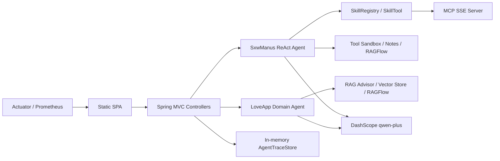

# sxw-ai-agent

一个基于 Spring Boot 3.4、Spring AI Alibaba 和 JDK 21 的企业化 AI Agent 示例项目。项目围绕“可运行、可观测、可扩展、可验证”设计，适合作为简历项目展示 Spring AI、Agent 工具调用、RAG、MCP、缓存、限流熔断、评测与运维监控能力。

## 项目定位

`sxw-ai-agent` 不是单纯的聊天 Demo，而是一个后端工程化 AI Agent 项目：

- LoveApp：面向情感咨询场景的领域 Agent，支持会话记忆、RAG、结构化输出和流式响应。
- SxwManus：通用 ReAct Agent，按请求创建实例，避免并发状态污染，支持工具调用、技能按需加载和运行轨迹追踪。
- MCP Server：将内部技能暴露给 Codex Desktop、Cursor 等外部 Agent 客户端。
- 质量体系：提供单元测试、评测数据集、Micrometer 指标、Resilience4j 保护和 Docker 部署样例。

## 架构图



## 核心能力

- Agent 编排：`BaseAgent -> ReActAgent -> ToolCallAgent -> SxwManus` 分层清晰，支持同步和 SSE 流式执行。
- 工具调用：通过 Spring AI `ToolCallback` 接入笔记、技能、搜索、RAGFlow 等工具；终端工具默认关闭并带白名单。
- RAG 增强：内置本地向量检索链路，并可按环境变量接入本机 RAGFlow。
- 运行轨迹：Manus 每次执行记录 `traceId`、`chatId`、阶段、工具名、输入/输出摘要、状态和耗时。
- 可观测性：Actuator、Prometheus、LLM 缓存命中率、token、延迟和 Agent 步骤指标。
- 安全治理：可选 API Key 拦截器保护 `/ai/**`、`/notes/**`、`/skills/**`、`/agent/**`。
- 测试与评测：普通单测默认不消耗 LLM token；评测套件需要手动启用。

## 环境要求

- JDK 21
- Maven 3.9+
- DashScope API Key
- 可选：本机 RAGFlow，默认地址 `http://localhost:9380`

> 常见问题：如果本机是 Java 17，直接运行 `mvn test` 会报“不支持发行版本 21”。请安装 JDK 21，并确认 `java -version` 与 `mvn -version` 都指向 JDK 21。

## 快速启动

复制环境变量模板：

```bash
cp .env.example .env
```

至少配置：

```bash
DASHSCOPE_API_KEY=sk-xxx
DASHSCOPE_CHAT_MODEL=qwen-plus
```

启动应用：

```bash
mvn spring-boot:run
```

访问：

- 健康检查：http://localhost:8123/api/health
- 前端页面：http://localhost:8123/api/
- API 文档：http://localhost:8123/api/doc.html
- Actuator：http://localhost:8123/api/actuator/health

## RAGFlow 接入

默认关闭，避免影响本地开发。接入本机 RAGFlow 时配置：

```bash
RAGFLOW_ENABLED=true
RAGFLOW_BASE_URL=http://localhost:9380
RAGFLOW_API_KEY=<your-ragflow-api-key>
RAGFLOW_DATASET_IDS=<dataset-id-1,dataset-id-2>
```

LoveApp RAGFlow 接口：

```http
GET /api/ai/love_app/chat/ragflow/sync?message=...&chatId=...
```

## API Key 保护

本地默认关闭。公网演示或部署时建议开启：

```bash
SXW_SECURITY_API_KEY_ENABLED=true
SXW_SECURITY_API_KEY=<strong-random-value>
```

开启后，请求以下接口需要请求头：

```http
X-SXW-API-Key: <strong-random-value>
```

受保护路径：

- `/api/ai/**`
- `/api/notes/**`
- `/api/skills/**`
- `/api/agent/**`

## Manus 运行轨迹

查询最近运行轨迹：

```http
GET /api/agent/traces/{chatId}?limit=5
```

配置容量：

```bash
SXW_AGENT_TRACE_MAX_RUNS=100
SXW_AGENT_TRACE_MAX_EVENTS_PER_RUN=200
```

前端 Manus 面板会展示最近一次执行时间线，便于观察 Agent 思考、工具调用、工具返回和完成状态。

## 测试

普通测试：

```bash
mvn test
```

CI 验证：

```bash
mvn verify
```

评测套件默认排除，避免消耗 LLM token。需要手动运行：

```bash
mvn test -Dgroups=eval -Dtest=LoveAppEvalSuiteTest
```

## Docker

```bash
docker compose --env-file .env up -d --build
```

生产 / 演示环境不要把真实 Key 写入仓库，请通过环境变量或密钥管理系统注入。

## 简历话术

可以这样描述这个项目：

> 设计并实现了一个基于 Spring AI 的企业级 AI Agent 平台，支持领域 Agent、ReAct 通用 Agent、MCP 技能暴露、RAGFlow 知识库增强、工具沙箱、LLM 调用缓存、限流熔断、Prometheus 监控、Agent 运行轨迹可视化和自动化评测。项目通过分层 Agent 架构、按请求实例化、内存 trace store、可选 API Key 鉴权和 CI 测试，提高了 AI 应用在可观测性、安全性和工程可维护性上的完整度。

## 后续规划

- 将内存向量库切换为 PgVector，并补全数据库迁移脚本。
- 将静态页面迁移为独立前端工程，加入 API Key 配置、登录态和更完整的可观测面板。
- 将 Agent trace、会话记忆和评测报告持久化，便于长期分析。
- 补充 GitHub Actions、Docker 镜像发布和线上演示环境。
