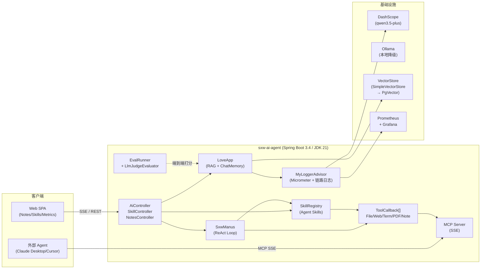

# sxw-ai-agent

> 基于 **Spring AI Alibaba** 的生产级 LLM Agent 平台。集成 RAG、多工具 ReAct 智能体、MCP 协议互通、Anthropic Agent Skills、自动化评测流水线、Prometheus 可观测，以及完整 Docker / GitHub Actions CI/CD。

<!-- 替换 OWNER/REPO 为你的 GitHub 仓库 slug -->
[](https://github.com/OWNER/REPO/actions/workflows/ci.yml)
[](https://github.com/OWNER/REPO/actions/workflows/eval.yml)
[](https://github.com/OWNER/REPO/pkgs/container/repo)
[](https://openjdk.org/projects/jdk/21/)
[](https://spring.io/projects/spring-boot)
[](https://java2ai.com/)

---

## 🎯 一句话定位

一套**可以直接给面试官跑起来**的 LLM Agent 工程化范例：从 prompt 设计到 RAG，从 ReAct 调度到 MCP 协议，从评测看门到 Prometheus 大盘 —— **每一层都有可验证的工程产物**。

## ✨ 核心特性

| 维度 | 落地点 |
|---|---|
| 🤖 **LoveApp**（情感顾问） | RAG（SimpleVectorStore + 关键词增强 + 查询重写）+ ChatMemory + 自定义 Advisor 链 |
| 🦾 **SxwManus**（通用智能体） | ReAct 循环 + 7 个 Tool（文件 / 搜索 / 抓网页 / 终端 / PDF / 终止 / 资源下载） |
| 🔌 **MCP Server** | 通过 SSE 把 NoteSkill / SkillTool 暴露给外部 Agent（Claude Desktop / Cursor 零适配） |
| 📜 **Agent Skills** | Anthropic 规范的 Java 实现：`SKILL.md` + frontmatter，progressive disclosure 节省 ~85% prompt token |
| 🧪 **Evaluation Harness** | YAML 黄金集 + 三类评估器（关键词 / LLM-as-Judge / 延迟阈值），输出 markdown 报告，CI 守门 |
| 📊 **可观测** | Micrometer + Prometheus + 前端实时大盘（缓存命中率 / Token 累计 / Agent 步数 / 错误率） |
| 🛡️ **工具沙箱** | 笔记目录隔离 + 路径穿越防护 + 终端命令白名单 + 单文件大小上限 |
| 🚀 **生产化** | 多阶段 Dockerfile（非 root + healthcheck）、docker-compose、GitHub Actions（CI + Eval）、GHCR 镜像 |

## 🏗️ 架构



## 🚀 快速启动

### 方式 A：Docker Compose（推荐）

```bash
# 1. 复制环境变量模板
cp .env.example .env  # 然后填入 DASHSCOPE_API_KEY 等

# 2. 启动
docker compose up -d

# 3. 浏览器打开
open http://localhost:8123/api
```

### 方式 B：本地开发

```bash
# 需要 JDK 21
export DASHSCOPE_API_KEY=sk-xxx
mvn spring-boot:run

# 端口 8123，context-path /api
curl http://localhost:8123/api/health
```

### 方式 C：拉 GHCR 镜像直接跑

```bash
docker run --rm -p 8123:8123 \
  -e DASHSCOPE_API_KEY=sk-xxx \
  ghcr.io/owner/repo:latest
```

## 🧪 跑评测

```bash
# 默认 mvn test 跳过 eval（不烧 token）
mvn test

# 手动跑端到端评测，报告输出到 target/eval-report.md
mvn -Dgroups=eval test -Dtest=LoveAppEvalSuiteTest

# CI 触发：手动 / 每周一 02:00 UTC / PR 加 run-eval 标签
# 见 .github/workflows/eval.yml
```

数据集：`src/main/resources/eval/love-app.yaml`（6 条覆盖 empathy / structure / safety / refusal / chinese 五个类别）

## 📦 Agent Skills

把领域知识打包成文件夹，启动期只读摘要进 prompt，命中后通过 `loadSkill` 工具加载完整正文：

```
src/main/resources/skills/
├── love-counsel/SKILL.md      # 情感咨询操作手册
└── note-workflow/SKILL.md     # 笔记整理工作流
```

REST 调试：

```bash
curl http://localhost:8123/api/skills              # 列摘要
curl http://localhost:8123/api/skills/love-counsel # 完整正文
```

前端 **Skills** tab 直接可视化所有 skill 与 SKILL.md 内容。

## 📊 可观测

- `GET /api/actuator/health`
- `GET /api/actuator/prometheus`
- 前端 **监控面板** tab：LLM 缓存命中率 / Token 累计 / 平均延迟 / Agent 步数分布

关键 Metric：

| 指标 | 含义 |
|---|---|
| `ai_chat_cache_total{outcome}` | 语义缓存命中 / miss-stored / miss-skipped |
| `ai_chat_tokens_total{kind}` | prompt / completion / total tokens |
| `ai_chat_latency_seconds` | 端到端延迟（P50/P99） |
| `ai_agent_steps_total` | Manus ReAct 单次任务步数分布 |

## 🔧 关键工程决策

- **MCP 解耦**：技能（NoteSkill / SkillTool）以 `@Tool` 注解定义，本进程 Agent 与外部 MCP 客户端**同一份代码**，避免重复实现。
- **Manus 非单例**：`SxwManus` 持有会话级可变状态，每次请求 `new` 实例，规避并发污染；线程池显式可观测（`agentTaskExecutor`）。
- **History trim**：`ToolCallAgent.trimHistoryIfNeeded()` 防 token 爆炸。
- **JsonOutput judge**：自写 LLM Judge 强约束 JSON 输出 + markdown 围栏降级，**实现 Spring AI `Evaluator` 接口**可与官方 `RelevancyEvaluator` 互换。
- **Surefire excludedGroups=eval**：默认 `mvn test` 不烧 token，CI 友好。

## 🗺️ Roadmap

- [ ] PgVector 持久化 + JdbcChatMemoryRepository
- [ ] PromptShield Advisor（注入检测）+ PII 出口脱敏
- [ ] 多模型路由（DashScope ↔ Ollama 降级）
- [ ] Agent 推理路径前端可视化（React Flow）
- [ ] Tool 插件热加载（OpenAPI spec → ToolCallback）

## 📁 目录速览

```
src/main/java/com/sxw/sxwaiagent/
├── love/                LoveApp + Advisors + 文档加载
├── manus/               SxwManus / ReActAgent / ToolCallAgent
├── infrastructure/
│   ├── advisor/         MyLoggerAdvisor (Micrometer)
│   ├── eval/            评测流水线
│   ├── rag/             向量库 + 关键词增强 + 查询重写
│   ├── skill/           Agent Skills + NoteSkill
│   └── tools/           7 个 ToolCallback
├── mcp/                 MCP server 配置
└── web/controller/      AiController / SkillController / NotesController

src/main/resources/
├── eval/love-app.yaml   评测黄金集
├── skills/*/SKILL.md    Agent Skills
└── static/index.html    前端 SPA
```

## 📜 License

MIT
